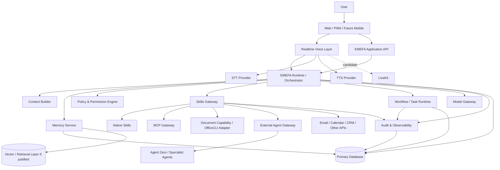

# EMEFA — ARCHITECTURE.md

> **Document type:** Target architecture specification  
> **Project mode:** Brownfield continuation  
> **Repository:** `gavoekoffi2/emefa-assistant`  
> **Rule:** This document defines architectural direction, not permission to rewrite working Hermes implementation. Reconcile every major decision with `CURRENT_STATE_ASSESSMENT.md` and record irreversible choices in ADRs.

---

# 1. Architecture Objective

EMEFA must evolve into a secure, modular, multi-tenant AI executive-assistant platform capable of:

- natural text and realtime voice interaction;
- deep business context;
- controlled long-term memory;
- safe tool/Skill execution;
- administrative workflows;
- professional document generation;
- continuous business-development assistance;
- proactive and recurring workflows;
- specialist-agent delegation;
- African language expansion;
- provider substitution without rebuilding the product.

The architecture must optimize for:

```text
Product Value
+ Trust
+ Extensibility
+ Reliability
+ Cost Control
+ Maintainability
```

Not maximum architectural novelty.

---

# 2. Brownfield Principle

The current repository is the source of truth for existing implementation.

Before modifying a major subsystem:

```text
Inspect
→ Understand
→ Classify
→ Preserve Contract
→ Improve / Adapt
→ Test Side-by-Side
→ Migrate Gradually
```

Allowed classifications:

- KEEP
- KEEP + HARDEN
- REFACTOR
- MIGRATE
- REPLACE
- REMOVE
- UNKNOWN / REQUIRES BENCHMARK

No major replacement without evidence.

---

# 3. Architectural Style

Preferred default:

> **Modular monolith with explicit domain boundaries, plus separate infrastructure workers/services only where operational requirements justify them.**

Do not begin with excessive microservices.

Reasons:

- early-stage product;
- easier transactions;
- simpler deployment;
- lower operational cost;
- easier refactoring;
- faster iteration.

Extract services only for clear needs such as:

- realtime media infrastructure;
- isolated browser/computer execution;
- long-running workers;
- specialized GPU workloads;
- independently scaling workloads.

---

# 4. Logical Architecture



This is a logical target. Adapt to verified existing code rather than forcing unnecessary structure.

---

# 5. Core Architectural Boundaries

EMEFA should have explicit boundaries for:

1. Identity & tenancy
2. Assistant profile
3. Conversation/session
4. Context assembly
5. Memory
6. Orchestration
7. Model gateway
8. Policy/permissions
9. Skills/tools
10. Workflows/tasks
11. Documents
12. Business development
13. Voice/realtime
14. External agents
15. Audit/observability
16. Notifications

These may initially coexist in one deployable backend.

---

# 6. Identity and Multi-Tenancy

Conceptual ownership:

```text
Tenant / Organization
├── Users
├── Assistants
├── Business Profiles
├── Memories
├── Knowledge
├── Skills / Integrations
├── Credentials
├── Workflows
├── Prospects / Opportunities
├── Artifacts
└── Audit Events
```

Requirements:

- every persistent business resource has explicit ownership;
- server-side authorization;
- no reliance on prompt isolation;
- no trust in client-supplied tenant IDs alone;
- credentials scoped to tenant/user/integration as appropriate.

Prefer explicit ownership columns and enforced query boundaries.

If database technology supports row-level security and it fits existing architecture, evaluate it via ADR rather than assuming it.

---

# 7. Assistant Domain

An assistant is not just a prompt.

Conceptual model:

```text
Assistant
├── Identity
├── Personality
├── Voice Profile
├── Language Preferences
├── Business Context
├── Memory Policies
├── Enabled Skills
├── Permission Policies
└── Proactive Workflow Policies
```

System-level product/security instructions remain controlled by EMEFA.

Users may customize personality and preferences without overriding security policy.

---

# 8. EMEFA Runtime / Orchestrator

The runtime coordinates work.

Conceptual lifecycle:

```text
User Intent
→ Normalize Request
→ Load Identity/Tenant
→ Build Context
→ Retrieve Relevant Memory
→ Determine Task Type
→ Plan if Needed
→ Policy Evaluation
→ Select Skill / Workflow / Model
→ Execute
→ Verify
→ Persist State
→ Audit
→ Respond
→ Store Relevant Memory
```

Not every request needs every stage.

Simple conversational requests should remain fast.

Complex/consequential tasks use explicit task state.

---

# 9. Task Model

Use a durable task abstraction for meaningful work.

Conceptual fields:

```text
Task
- id
- tenant_id
- assistant_id
- user_id
- type
- intent
- status
- risk_level
- plan
- input
- output
- approval_state
- budget
- created_at
- updated_at
- correlation_id
```

Status vocabulary:

```text
PLANNED
PREPARED
AWAITING_APPROVAL
EXECUTING
QUEUED
PARTIALLY_COMPLETED
COMPLETED
VERIFIED
FAILED
CANCELLED
```

Do not force trivial chat turns into heavyweight durable workflows unless useful.

---

# 10. Context Builder

The Context Builder assembles only relevant information.

Sources may include:

- current conversation;
- assistant profile;
- user profile;
- business profile;
- relevant memory;
- active task state;
- connected knowledge;
- skill metadata;
- permission policy.

Avoid dumping all memory into every prompt.

Use context budgets.

Treat retrieved external content as untrusted.

---

# 11. Model Gateway

Business logic must not be tightly coupled to one model provider.

Conceptual interface:

```text
ModelGateway
├── generate()
├── generate_structured()
├── stream()
├── tool_reasoning()
└── embeddings() [if needed]
```

Routing may consider:

- complexity;
- latency;
- cost;
- privacy;
- modality;
- language;
- provider availability.

Use schema validation for structured outputs.

Do not build a generic abstraction so broad that provider capabilities become unusable. Preserve provider-specific extensions behind adapters when needed.

---

# 12. Memory Architecture

Memory should be structured by purpose.

```text
Memory
├── User Profile
├── Organization / Business Facts
├── Preferences
├── Relationships
├── Procedures
├── Episodic Summaries
├── Active Work State
└── Knowledge Retrieval
```

A memory item should support where appropriate:

```text
id
tenant_id
subject
type
content / structured_value
source
confidence
sensitivity
created_at
updated_at
expires_at
```

Memory write pipeline:

```text
Candidate Fact
→ Relevance Check
→ Sensitivity Check
→ Deduplicate / Merge
→ Provenance
→ Store
```

Do not save every message as permanent memory.

---

# 13. Retrieval

Use relational/structured retrieval first when data is structured.

Use semantic/vector retrieval where it materially helps.

Avoid introducing a vector database merely because the product uses AI.

Possible strategy:

```text
Structured Query
        +
Semantic Retrieval
        ↓
Reranking / Relevance
        ↓
Context Budget
```

Benchmark before adding infrastructure complexity.

---

# 14. Skills Architecture

A Skill is a controlled capability.

Conceptual interface:

```text
SkillDefinition
- id
- version
- description
- input_schema
- output_schema
- permissions
- risk_class
- confirmation_policy
- timeout
- retry_policy
- cost_metadata
- verification_strategy
```

Execution:

```text
Intent
→ Skill Candidate
→ Availability
→ Permission
→ Validate Input
→ Execute Adapter
→ Validate Output
→ Verify
→ Audit
```

The LLM may recommend a skill.

The policy engine decides whether execution is allowed.

---

# 15. Skills Gateway

The gateway provides one controlled boundary for capability execution.

```text
Skills Gateway
├── Native Function Adapter
├── REST/API Adapter
├── MCP Adapter
├── CLI Adapter
├── Browser/Computer Adapter
├── Document Adapter
└── External Agent Adapter
```

Benefits:

- consistent authorization;
- audit;
- timeouts;
- retries;
- cost tracking;
- result normalization;
- provider replacement.

Do not expose unrestricted shell execution to the model.

---

# 16. MCP Gateway

MCP is one integration protocol.

Architecture:

```text
EMEFA Runtime
→ Skills Gateway
→ MCP Gateway
→ Registered MCP Server
```

MCP registry metadata:

```text
server_id
tenant_scope
transport
allowed_tools
credential_reference
trust_level
health
rate_limits
```

Requirements:

- explicit registration;
- allowlisted tools;
- schema validation;
- credentials outside prompts;
- timeout;
- rate limiting;
- audit;
- prompt-injection defenses.

Never automatically trust instructions returned by an MCP server.

---

# 17. Document Capability Architecture

Users ask for outcomes, not CLI commands.

```text
EMEFA
→ DocumentCapability
→ Provider Adapter
    ├── OfficeCLI
    ├── Native Libraries
    └── Future Providers
→ Artifact Store
→ Validation / Rendering
```

Capabilities:

```text
create_document()
edit_document()
create_spreadsheet()
edit_spreadsheet()
create_presentation()
render_preview()
validate_artifact()
```

OfficeCLI is a candidate implementation provider, not a cross-cutting dependency.

Artifact metadata should include:

- owner;
- type;
- source task;
- version;
- storage location;
- validation state.

---

# 18. External Agent Gateway

Agent Zero and similar systems are specialist workers.

```text
EMEFA Runtime
→ External Agent Gateway
→ Specialist Agent
→ Structured Result
→ Verification
→ EMEFA
```

Gateway responsibilities:

- context minimization;
- capability allowlist;
- task contract;
- timeout;
- budget;
- cancellation;
- credential isolation;
- output validation;
- audit.

External agents must not:

- directly control EMEFA identity;
- bypass policy;
- receive all user memory by default;
- gain unrestricted credentials.

---

# 19. Realtime Voice Architecture

Target:

```text
Browser / Client
    ↓ audio
Realtime Session Layer
    ↓
VAD / Turn Detection
    ↓
STT Adapter
    ↓ text/events
EMEFA Runtime
    ↓ response
TTS Adapter
    ↓ audio
Realtime Session Layer
    ↓
Client
```

Support:

- interruption;
- partial transcripts;
- session state;
- reconnect;
- cancellation;
- tool-progress events.

Voice must connect to the same core EMEFA runtime as text wherever practical.

Avoid creating a separate “voice brain.”

---

# 20. LiveKit Role

LiveKit should be evaluated for:

- WebRTC;
- realtime media;
- session management;
- interruption;
- agent media transport;
- future multimodal capabilities.

It should sit behind a realtime boundary.

```text
RealtimeProvider
├── Existing ElevenLabs Path
└── LiveKit Path
```

LiveKit does not automatically replace:

- STT;
- LLM;
- TTS;
- business logic;
- memory;
- permissions.

Adoption requires benchmark and ADR.

---

# 21. ElevenLabs Role

Existing ElevenLabs functionality is valuable and must not be removed prematurely.

Possible long-term roles:

- premium TTS;
- premium conversational voice;
- fallback provider;
- specific language/voice option.

Migration pattern:

```text
Existing ElevenLabs
→ Measure
→ Abstract
→ Add Alternative
→ Shadow/Test
→ Compare
→ Feature Flag
→ Gradual Migration
```

Rollback must remain possible until validated.

---

# 22. Voice Provider Interfaces

Conceptual interfaces:

```text
RealtimeProvider
- create_session()
- connect()
- disconnect()
- send_audio()
- receive_events()

STTProvider
- transcribe_stream()
- transcribe_file()

TTSProvider
- synthesize()
- synthesize_stream()
```

Do not force these exact methods if existing architecture suggests better contracts.

The principle is separation of responsibilities.

---

# 23. Voice Event Model

Normalize events such as:

```text
session.started
user.speech_started
user.speech_stopped
transcript.partial
transcript.final
assistant.thinking
assistant.tool_started
assistant.tool_completed
assistant.speech_started
assistant.speech_stopped
assistant.interrupted
session.error
session.ended
```

Frontend visual/3D state should consume normalized events rather than provider-specific payloads where practical.

This protects the immersive UI from provider migration.

---

# 24. Immersive Frontend Architecture

Preserve existing high-value UI.

Recommended conceptual separation:

```text
Application State
      ↓
Assistant State Machine
      ↓
Visual Presentation
      ├── 3D Scene
      ├── Motion
      ├── Transcript
      ├── Task Progress
      └── Approval UI
```

Do not embed core business logic inside 3D components.

The 3D layer should react to normalized assistant state.

Provide:

- reduced-motion mode;
- non-WebGL fallback;
- mobile performance strategy.

---

# 25. Assistant State Machine

Conceptual states:

```text
IDLE
LISTENING
UNDERSTANDING
PLANNING
AWAITING_APPROVAL
EXECUTING
VERIFYING
SPEAKING
COMPLETED
WARNING
FAILED
```

Actual implementation may use parallel substates.

Do not derive critical backend execution truth solely from frontend animation state.

---

# 26. Policy and Permission Engine

Authorization must be independent from LLM persuasion.

Input:

```text
actor
tenant
assistant
requested_action
skill
resource
risk
stored_policy
session_approval
```

Output:

```text
ALLOW
DENY
REQUIRE_APPROVAL
```

Possible approval scopes:

- single action;
- current task;
- session;
- persistent bounded policy.

High-risk operations require stronger controls.

---

# 27. Risk Classes

Minimum conceptual classes:

```text
R0 — conversational/read-only
R1 — reversible local creation/update
R2 — external communication
R3 — destructive or broad-impact
R4 — financial/legal/security-sensitive
```

Exact taxonomy should be formalized in security specifications.

Risk must not be determined solely by the LLM.

---

# 28. Approval Architecture

```text
Task Requests Action
→ Policy Engine
→ Approval Required
→ Persist Approval Request
→ Notify / Show User
→ User Approves or Rejects
→ Revalidate Context
→ Execute
→ Verify
→ Audit
```

Approval must bind to sufficiently specific action details.

Do not allow approval for one action to silently authorize materially different actions.

---

# 29. Durable Workflow Architecture

Not all tasks need a workflow engine.

Use durable workflows for:

- long-running tasks;
- recurring work;
- waits;
- external callbacks;
- multi-step prospecting;
- asynchronous approvals;
- retryable integrations.

Conceptual:

```text
Workflow Definition
→ Workflow Instance
→ Steps
→ Durable State
→ Events / Timers
→ Retry / Compensation
```

Select implementation only after ADR.

Avoid building a custom workflow engine casually.

---

# 30. Proactive Engine

Proactivity should be event/policy driven.

Sources:

- schedule;
- task deadlines;
- CRM state;
- communication events;
- workflow timers;
- approved monitoring.

Flow:

```text
Trigger
→ Evaluate User Policy
→ Gather Context
→ Determine Relevance
→ Suggest / Prepare / Execute
→ Notify if Needed
→ Audit
```

Avoid constant expensive LLM polling.

Prefer deterministic triggers where possible.

---

# 31. Business Development Architecture

Logical domain:

```text
Business Profile
→ ICP
→ Prospect Sources
→ Discovery
→ Deduplication
→ Enrichment / Research
→ Qualification
→ Pipeline
→ Outreach Preparation
→ Approval
→ Communication
→ Follow-Up
→ Outcome
```

Core entities may include:

```text
IdealCustomerProfile
Prospect
Contact
Qualification
Opportunity
OutreachDraft
Interaction
FollowUp
```

Keep provenance for prospect data.

Respect legal/platform constraints.

---

# 32. Prospecting Orchestration

Example workflow:

```text
User Goal
→ Load Offer + ICP
→ Select Authorized Sources
→ Discover Candidates
→ Normalize
→ Deduplicate
→ Research
→ Score / Qualify
→ Persist
→ Prepare Personalized Actions
→ Approval if Communication
→ Execute
→ Track Outcome
```

Use bounded batch sizes and budgets.

Do not create infinite prospecting loops.

---

# 33. Administrative Domain Architecture

Capabilities may integrate:

```text
Email
Calendar
Contacts
Tasks
Meetings
Documents
Notifications
```

Keep provider-specific logic behind adapters.

Examples:

```text
EmailProvider
CalendarProvider
ContactProvider
```

Domain logic should reason in EMEFA concepts rather than provider-specific API objects.

---

# 34. Integration Credentials

Never pass raw credentials unnecessarily through model context.

Use a credential vault/secure storage pattern appropriate to deployment.

Conceptual reference:

```text
IntegrationCredential
- tenant_id
- provider
- encrypted_secret / external_vault_ref
- scopes
- status
- created_at
- rotated_at
```

Skills receive temporary/minimum required access.

---

# 35. API Architecture

Use explicit typed API contracts.

Potential API groups:

```text
/auth
/organizations
/assistants
/conversations
/tasks
/approvals
/memory
/skills
/integrations
/artifacts
/prospects
/workflows
/voice
/audit
```

Do not create endpoints mechanically if existing architecture has better grouping.

Requirements:

- authentication;
- authorization;
- validation;
- consistent errors;
- idempotency where applicable;
- versioning strategy.

---

# 36. Realtime Application Events

In addition to voice media, EMEFA needs realtime application events.

Possible channels:

- WebSocket;
- SSE;
- LiveKit data channels;
- existing verified mechanism.

Events:

```text
task.status_changed
approval.requested
tool.started
tool.progress
tool.completed
artifact.created
workflow.updated
notification.created
```

Choose one coherent event model.

Avoid multiple incompatible realtime systems without justification.

---

# 37. Persistence Strategy

Primary transactional data should live in a durable database.

Conceptual categories:

```text
Identity
Assistant Configuration
Business Context
Memory
Tasks
Approvals
Skills
Integrations
Artifacts Metadata
Prospects
Workflows
Audit
```

Binary artifacts belong in object/file storage rather than bloating relational rows when scale warrants.

Actual database choice must follow current-state audit and ADR.

---

# 38. Caching

Use caching selectively for:

- provider metadata;
- repeated safe retrieval;
- expensive non-sensitive computations;
- session acceleration.

Do not cache authorization decisions longer than safely valid.

Do not allow tenant leakage through cache keys.

---

# 39. Background Workers

Use workers for tasks such as:

- document rendering;
- prospect batch research;
- long integrations;
- scheduled workflows;
- notifications;
- heavy extraction.

Workers must:

- authenticate task origin;
- enforce tenant context;
- be idempotent where practical;
- report status;
- support retry policy.

---

# 40. Artifact Architecture

Artifacts include:

- documents;
- spreadsheets;
- presentations;
- reports;
- generated files.

Conceptual:

```text
Artifact
- id
- tenant_id
- task_id
- type
- version
- storage_ref
- mime_type
- validation_status
- created_at
```

Never expose arbitrary server filesystem paths to users.

---

# 41. Audit Architecture

Consequential events should produce structured audit records.

Examples:

- permission changes;
- integration connections;
- outbound messages;
- file changes;
- workflow executions;
- external-agent delegation;
- destructive actions.

Audit is not the same as verbose application logs.

Audit records should be stable and queryable.

---

# 42. Observability Architecture

Use correlation IDs across:

```text
User Request
→ Conversation
→ Task
→ Model Call
→ Skill
→ External Provider
→ Verification
```

Track:

- latency;
- errors;
- retries;
- token usage;
- STT/TTS usage;
- tool cost;
- workflow duration.

Never log secrets.

---

# 43. Cost Architecture

Every expensive subsystem should expose usage metadata where feasible.

Conceptual cost ledger:

```text
UsageEvent
- tenant_id
- task_id
- provider
- capability
- units
- estimated_cost
- timestamp
```

Supports:

- cost monitoring;
- quotas;
- model routing;
- pricing decisions.

---

# 44. Security Trust Boundaries

Treat as untrusted:

- user input;
- uploaded files;
- websites;
- email content;
- MCP responses;
- tool output;
- external-agent output;
- model output.

Architecture must separate:

```text
Trusted Policy
User Intent
Untrusted Content
Execution Capability
```

Never let retrieved content directly grant permissions.

---

# 45. Prompt Injection Defense Architecture

Use layered controls:

1. instruction hierarchy;
2. context labeling;
3. tool allowlists;
4. deterministic permission checks;
5. schema validation;
6. URL/network restrictions;
7. file/path restrictions;
8. human approval for consequential actions;
9. output verification.

Prompting alone is not a security boundary.

---

# 46. Browser / Computer Use

If added, run in isolated environments.

Controls:

- domain allowlists where appropriate;
- session isolation;
- filesystem sandbox;
- credential boundaries;
- action logging;
- screenshot/state capture where useful;
- approval gates.

Do not give a general model unrestricted access to production infrastructure.

---

# 47. File Safety

Uploaded/generated files require:

- MIME/type validation;
- size limits;
- safe filenames;
- malware scanning where appropriate;
- parser isolation for risky formats;
- tenant-scoped storage;
- signed/authorized access.

CLI document tools must operate in controlled working directories.

---

# 48. Failure Architecture

Every external call may fail.

Use:

```text
Timeout
→ Retry if Safe
→ Backoff
→ Circuit Breaker if Needed
→ Partial Result / Fallback
→ Honest User Status
```

Never hide partial failure.

---

# 49. Idempotency

Use idempotency for consequential repeatable actions such as:

- send communication;
- create event;
- create invoice/record;
- execute workflow step.

Retries must not accidentally duplicate external actions.

---

# 50. Verification Layer

Verification is a first-class concept.

Examples:

```text
Email send
→ fetch/send confirmation

Calendar create
→ retrieve created event

Document create
→ parse/open/render

Prospect save
→ retrieve persisted record

External agent task
→ validate output contract
```

A tool returning “success” may not be sufficient for high-value operations.

---

# 51. Notification Architecture

Notifications should originate from meaningful events.

Channels may later include:

- in-app;
- email;
- push;
- messaging integrations.

Use user preferences and urgency.

Avoid notification spam.

---

# 52. African Language Architecture

Keep language processing modular.

```text
Audio
→ Language Detection / Session Language
→ STT
→ Normalized Text
→ EMEFA Runtime
→ Response Text
→ TTS
```

Support code-switching experiments.

Maintain language evaluation datasets/cases.

Do not hard-code French-only assumptions into core domain models.

---

# 53. Deployment Topology — Initial Direction

Prefer simple deployability.

Conceptually:

```text
Frontend
Backend/API
Worker(s)
Database
Object Storage
Realtime Provider
External Providers
```

Do not split every domain into a separate service initially.

Use containers where consistent with existing deployment.

Maintain separate:

- local;
- staging;
- production

configurations where feasible.

---

# 54. Configuration

Use environment/configuration layers.

Never commit secrets.

Validate required configuration at startup.

Separate:

- public client configuration;
- server secrets;
- tenant integration credentials.

---

# 55. Feature Flags

Use feature flags/configuration for risky migrations:

- new voice stack;
- new provider;
- new orchestration path;
- new prospecting source.

Flags should support rollback.

Avoid permanent flag debt.

---

# 56. Testing Architecture

Testing pyramid should include:

```text
Unit
Integration
Contract
End-to-End
Agent Evaluations
Security Tests
Voice Benchmarks
```

Use provider mocks/fakes carefully.

Critical integrations also require real sandbox/staging tests where available.

---

# 57. AI Evaluation Architecture

Maintain datasets/scenarios for:

- tool selection;
- task completion;
- hallucination;
- permission compliance;
- prompt injection;
- memory relevance;
- French;
- African-language pilots;
- prospect qualification;
- failure recovery.

Version evaluation results with major prompt/model changes.

---

# 58. CI/CD Architecture

Pipeline should eventually enforce:

```text
Install
→ Lint
→ Typecheck
→ Unit Tests
→ Integration Tests
→ Build
→ Security Checks
→ Migration Validation
→ Deploy Staging
→ Smoke Tests
→ Controlled Production Promotion
```

Exact pipeline must match current infrastructure.

---

# 59. Migration Strategy

For any major subsystem migration:

```text
Baseline
→ Adapter Boundary
→ New Implementation
→ Parallel Validation
→ Feature Flag
→ Partial Traffic
→ Metrics
→ Gradual Rollout
→ Legacy Removal
```

Required for voice migration.

Use expand/migrate/contract patterns for data changes.

---

# 60. ADR Requirements

Create ADRs for major decisions.

Likely initial ADRs:

```text
ADR-001 Voice / LiveKit Strategy
ADR-002 Primary Database & Tenancy
ADR-003 Memory Architecture
ADR-004 Skills + MCP Gateway
ADR-005 Workflow Runtime
ADR-006 External Agent Gateway
ADR-007 Document / OfficeCLI Strategy
```

Do not pre-decide outcomes before audit/benchmark.

---

# 61. Suggested Source-Code Boundaries

Adapt to existing repository.

Conceptual only:

```text
backend/
  domains/
    identity/
    assistants/
    conversations/
    memory/
    tasks/
    permissions/
    skills/
    documents/
    business_development/
    workflows/
    audit/
  infrastructure/
    models/
    voice/
    database/
    integrations/
    storage/
  api/
  workers/

frontend/
  features/
    assistant/
    conversation/
    voice/
    tasks/
    approvals/
    memory/
    skills/
    documents/
    prospects/
  components/
  realtime/
  3d/
```

Do not restructure the repository solely to match this example.

Use it to evaluate separation of concerns.

---

# 62. Dependency Direction

Preferred:

```text
UI
↓
Application / Use Cases
↓
Domain
↓
Interfaces
↑
Infrastructure Adapters
```

Domain logic should not depend directly on:

- ElevenLabs;
- LiveKit;
- OfficeCLI;
- Agent Zero;
- a specific model provider.

Adapters depend on domain interfaces, not the reverse.

Apply pragmatically, not dogmatically.

---

# 63. First Architectural Implementation Sequence

After `CURRENT_STATE_ASSESSMENT.md`:

## Step 1

Preserve working product and fix P0 security/reliability issues.

## Step 2

Establish identity/tenant/permission boundaries.

## Step 3

Stabilize assistant context and memory contracts.

## Step 4

Create/strengthen Skills Gateway.

## Step 5

Deliver one administrative vertical slice.

## Step 6

Deliver one business-development vertical slice.

## Step 7

Add durable workflow/proactivity only where required.

## Step 8

Benchmark and migrate voice architecture if justified.

## Step 9

Validate African-language providers.

## Step 10

Generalize assistant creation/multi-tenant platform.

Actual order may change based on audit evidence.

---

# 64. Architecture Quality Gates

Before accepting a major subsystem:

- clear ownership;
- typed contracts;
- authorization;
- tenant isolation;
- failure handling;
- observability;
- tests;
- cost awareness;
- rollback/migration where relevant;
- documentation.

For AI-driven execution also require:

- bounded behavior;
- permission enforcement;
- schema validation;
- verification;
- audit.

---

# 65. Anti-Patterns

Do not build:

## One Giant Agent Prompt

Core business state cannot exist only inside a prompt.

## Provider-Centric Architecture

EMEFA must not equal ElevenLabs, LiveKit, Claude, Agent Zero, or OfficeCLI.

## Tool Free-for-All

No unrestricted tool execution.

## Multi-Agent Theater

Do not create many agents merely to look sophisticated.

## Premature Microservices

Do not create operational complexity without need.

## Memory Dumping

Do not put all memory into every request.

## Fake Autonomy

Do not claim proactive execution without durable state, permissions, and verification.

## UI-Driven Security

Frontend checks are not authorization.

---

# 66. Architectural North Star

The system should ultimately allow this:

```text
User:
“EMEFA, trouve-moi de nouveaux prospects cette semaine,
prépare les relances et organise ce qui demande mon accord.”

        ↓

EMEFA understands:
- user
- business
- offer
- ICP
- permissions
- preferences

        ↓

EMEFA orchestrates:
- prospecting skills
- research
- qualification
- pipeline
- document/email tools

        ↓

EMEFA applies:
- policy
- approvals
- budgets
- verification

        ↓

EMEFA reports:
- completed work
- opportunities
- pending approvals
- failures
- next actions
```

The user should experience one coherent assistant.

Internally, the architecture may use many providers and services.

That complexity must remain behind EMEFA.

---

# 67. Final Architecture Principle

> **EMEFA owns the relationship, context, memory, permissions, orchestration, verification, and user experience. Providers supply capabilities.**

Therefore:

- LiveKit can transport realtime media.
- ElevenLabs can provide premium voice.
- OfficeCLI can create office artifacts.
- MCP can expose tools.
- Agent Zero can perform specialist work.
- model providers can reason and generate.

But none of them **is** EMEFA.

EMEFA is the coherent product layer that makes those capabilities useful, safe, personalized, and trustworthy.
