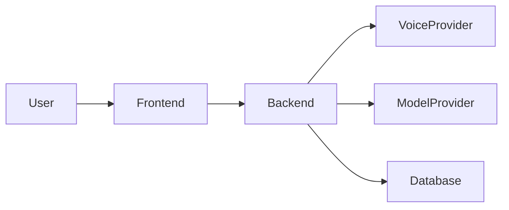

# EMEFA — CURRENT_STATE_ASSESSMENT.md

> **Document type:** Mandatory brownfield repository audit  
> **Repository:** `gavoekoffi2/emefa-assistant`  
> **Primary executor:** Claude  
> **Purpose:** Establish the verified current state of EMEFA before major implementation, migration, or architectural change.  
> **Rule:** This document must be completed from direct repository inspection. Never fill unknowns with assumptions.

---

# 1. Purpose

EMEFA already contains implementation work initiated by Hermes.

Claude must not treat the repository as greenfield.

This assessment exists to create an evidence-based bridge between:

```text
What Hermes already built
          ↓
What actually works today
          ↓
What the target specifications require
          ↓
What should be preserved / hardened / changed
          ↓
A safe implementation roadmap
```

The repository is the source of truth for current implementation.

Specifications define the intended destination.

This document must reconcile the two.

---

# 2. Mandatory Rules for This Audit

Before writing conclusions:

1. Inspect the complete repository tree.
2. Read root documentation.
3. Read package manifests and lockfiles.
4. Inspect frontend entry points and major modules.
5. Inspect backend entry points and major modules.
6. Trace realtime voice end-to-end.
7. Inspect environment/configuration handling.
8. Inspect persistence and migrations.
9. Inspect memory implementation.
10. Inspect orchestration and tool execution.
11. Inspect risk/permission logic.
12. Inspect tests.
13. Inspect deployment configuration.
14. Run safe existing checks where feasible.
15. Record evidence using file paths and symbols.

Do not modify architecture during the audit unless required to make the repository inspectable.

Do not silently “fix while auditing.”

Separate:

- observation;
- diagnosis;
- recommendation;
- implementation.

---

# 3. Classification Vocabulary

Every major subsystem must receive one status.

## KEEP

Sound implementation aligned with target direction.

No material structural change required.

## KEEP + HARDEN

Architecture is directionally correct but needs production hardening.

## REFACTOR

Core approach is valid but internal structure should improve without changing the fundamental subsystem.

## MIGRATE

Current subsystem should transition gradually to a new architecture/provider while preserving behavior and rollback.

## REPLACE

Current subsystem is materially unsuitable and should ultimately be replaced.

Requires strong evidence.

## REMOVE

Subsystem is obsolete, duplicated, unsafe, or no longer required.

## UNKNOWN / REQUIRES BENCHMARK

Insufficient evidence exists to make a responsible decision.

---

# 4. Executive Summary

Complete after the audit.

## Overall Assessment

Describe in concise terms:

- how mature the current implementation is;
- what already works;
- strongest engineering decisions;
- largest gaps;
- largest risks;
- readiness for continued development.

## Recommended Immediate Direction

List the 3–7 highest-priority next actions.

Do not list dozens of tasks here.

---

# 5. Repository Snapshot

Record:

- branch inspected;
- commit SHA;
- inspection date;
- working-tree state;
- runtime versions;
- package managers;
- lockfiles;
- deployment targets.

Example:

```text
Repository:
Branch:
Commit:
Node:
Python:
Package manager:
Database:
Frontend:
Backend:
Deployment:
```

Do not invent missing values.

---

# 6. Repository Map

Produce a concise tree of important directories.

Example structure only:

```text
/
├── web/
├── backend/
├── docs/
├── ...
```

For every major directory explain:

- responsibility;
- runtime relevance;
- active vs legacy status;
- important entry points.

Identify:

- production code;
- experiments;
- generated files;
- legacy code;
- dead code;
- duplicated implementations.

---

# 7. Architecture Overview

Create a verified current architecture diagram using Mermaid.

Example format:



The actual diagram must reflect inspected code.

Document:

- client boundaries;
- server boundaries;
- realtime channels;
- persistence;
- external providers;
- background processes;
- trust boundaries.

---

# 8. End-to-End Request Flow

Trace at least these flows from actual code.

## 8.1 Text Conversation

```text
User input
→ frontend
→ backend/runtime
→ model/orchestrator
→ result
→ frontend
```

Record exact files/functions/classes.

## 8.2 Voice Conversation

Trace:

```text
Microphone
→ session establishment
→ audio transport
→ speech recognition
→ transcript
→ agent/runtime
→ tool calls if any
→ response generation
→ TTS
→ streamed audio
→ user
```

Document exact responsibility of ElevenLabs.

Answer explicitly:

- Is ElevenLabs handling STT?
- Is ElevenLabs hosting the conversational agent?
- Is ElevenLabs handling TTS?
- Where is the system prompt?
- Where does EMEFA orchestration execute?
- How are tools invoked?
- How is interruption implemented?
- How are transcripts propagated?
- How is session state maintained?
- Where are credentials exchanged?
- What is client-side vs server-side?

No assumptions.

## 8.3 Tool Execution

Trace one existing tool call.

```text
User request
→ intent
→ tool selection
→ policy
→ execution
→ result
→ verification
→ user
```

Identify missing stages.

---

# 9. Frontend Assessment

Document:

- framework and versions;
- build tooling;
- routing;
- state management;
- API layer;
- realtime client;
- component organization;
- error handling;
- loading states;
- PWA implementation;
- responsive/mobile behavior;
- accessibility;
- tests.

Classify frontend overall.

---

# 10. Immersive / 3D Interface Assessment

This is strategically important.

Identify all current:

- 3D libraries;
- WebGL/canvas usage;
- shaders;
- particle systems;
- assistant visualizations;
- audio-reactive visuals;
- animations;
- state transitions.

Document screenshots or reproducible states if tooling permits.

Determine whether visuals are connected to actual assistant state.

Evaluate:

- visual identity;
- performance;
- mobile GPU load;
- accessibility;
- reduced-motion behavior;
- maintainability;
- responsiveness.

Classify each major visual component:

```text
KEEP
KEEP + HARDEN
REFACTOR
REPLACE
```

Preserve distinctive high-quality work.

Do not recommend replacing immersive UI with generic SaaS components merely for convenience.

---

# 11. JARVIS-Class Experience Gap Analysis

Evaluate current product against desired qualities:

| Quality | Current State | Gap | Priority |
|---|---|---|---|
| Immediate responsiveness | | | |
| Natural realtime voice | | | |
| Barge-in/interruption | | | |
| Visual presence | | | |
| 3D/spatial feedback | | | |
| Assistant state visibility | | | |
| Contextual awareness | | | |
| Proactivity | | | |
| Subtle personality | | | |
| Business usefulness | | | |

Do not interpret “JARVIS-class” as permission to copy protected assets or identity.

---

# 12. Backend Assessment

Document:

- framework/version;
- application entry point;
- module structure;
- dependency injection;
- configuration;
- API routes;
- service layer;
- domain layer;
- persistence;
- background jobs;
- realtime endpoints;
- tool execution;
- model/provider integrations;
- exception handling;
- tests.

Identify coupling between:

- business logic;
- providers;
- routes;
- prompts;
- database.

Classify backend overall.

---

# 13. Authentication and Identity

Determine current state of:

- authentication;
- sessions/tokens;
- users;
- organizations;
- assistants;
- roles;
- authorization.

Answer:

- Is authentication production-grade?
- Is there a tenant concept?
- Can multiple users safely coexist?
- Are server-side authorization checks enforced?
- Are IDs trusted from the client?

Document gaps.

---

# 14. Multi-Tenancy Assessment

Determine whether current architecture supports:

```text
Tenant
→ Users
→ Assistants
→ Memory
→ Skills
→ Credentials
→ Workflows
→ Audit
```

Inspect database queries and ownership boundaries.

Identify risk of cross-user or cross-tenant leakage.

Do not assume tenant isolation because IDs exist.

Classify:

```text
NOT PRESENT
PARTIAL
STRUCTURALLY READY
IMPLEMENTED
VERIFIED
```

---

# 15. Data and Persistence

Inventory:

- databases;
- ORM/query layer;
- schemas;
- migrations;
- local persistence;
- browser persistence;
- caches;
- vector stores;
- object storage.

For each major entity record:

- owner;
- tenant scope;
- lifecycle;
- sensitive fields;
- indexes;
- retention concerns.

Identify data duplicated across frontend/backend/providers.

---

# 16. Memory System Assessment

Trace actual memory behavior.

Identify:

- what is stored;
- where;
- when memory is written;
- how it is retrieved;
- how relevance is determined;
- whether provenance exists;
- whether confidence exists;
- whether users can inspect/correct/delete;
- whether memory is tenant-scoped.

Classify current memory into:

- profile;
- organization;
- preferences;
- relationships;
- procedures;
- episodic;
- active work;
- knowledge.

Identify which categories are missing.

---

# 17. Agent / Orchestration Assessment

Document actual orchestration.

Determine:

- single agent vs multiple;
- planner existence;
- loop limits;
- tool-selection mechanism;
- model provider;
- prompt structure;
- state management;
- failure handling;
- retry logic;
- cancellation;
- budget limits.

Answer:

- Is orchestration bounded?
- Can loops run indefinitely?
- Is execution state durable?
- Can long tasks resume?
- Are model outputs schema-validated?

Create a current orchestration diagram.

---

# 18. Tool System Assessment

Inventory every current tool/capability.

For each record:

| Tool | Purpose | Provider | Permissions | Risk | Verification | Status |
|---|---|---|---|---|---|---|

Determine:

- allowlist/registry;
- schemas;
- risk classification;
- confirmation policy;
- retries;
- timeouts;
- audit;
- verification.

Identify hard-coded tool logic.

Assess readiness for a generalized Skills architecture.

---

# 19. MCP Readiness

Determine whether MCP currently exists.

If yes:

- servers;
- transport;
- discovery;
- credentials;
- permissions;
- auditing.

If no, assess where an MCP adapter layer should integrate.

Do not redesign the entire runtime solely around MCP.

Target principle:

> MCP-first where useful, never MCP-only.

---

# 20. OfficeCLI Readiness

Determine current office/document capabilities.

Identify whether EMEFA can currently:

- create DOCX;
- modify DOCX;
- create XLSX;
- analyze spreadsheets;
- create PPTX;
- create PDF;
- use templates;
- apply branding;
- visually verify output.

Assess OfficeCLI integration path.

Recommended boundary:

```text
DocumentCapability
      ↓
Provider Adapter
      ↓
OfficeCLI / Alternative
```

Do not integrate OfficeCLI directly throughout business logic.

---

# 21. External Agent Readiness

Assess whether external agents can currently be delegated work.

Consider Agent Zero as a future specialist integration.

Determine required gateway boundaries:

- task contract;
- context minimization;
- permissions;
- timeout;
- budget;
- cancellation;
- result validation;
- audit.

Do not make Agent Zero the core EMEFA runtime.

---

# 22. ElevenLabs Assessment

Document current ElevenLabs integration precisely.

Record:

- product/API used;
- agent configuration;
- STT;
- TTS;
- realtime transport;
- prompts;
- tool integration;
- session creation;
- authentication;
- client/server responsibilities.

Estimate current architectural lock-in.

Classify:

```text
LOW
MODERATE
HIGH
CRITICAL
```

Document what would need abstraction before migration.

---

# 23. Voice Cost Baseline

Using actual configuration and available usage assumptions, create a cost model.

At minimum model:

```text
Cost per active minute
Cost per 10-minute session
Cost per 100 users
Cost per 1,000 users
```

Separate:

- realtime infrastructure;
- STT;
- LLM;
- TTS;
- other provider fees.

If exact prices are not available in repository, mark external research required.

Do not invent prices.

---

# 24. LiveKit Migration Readiness

Assess whether LiveKit should be introduced.

Do not assume adoption is mandatory.

Evaluate:

- compatibility with frontend;
- WebRTC requirements;
- backend integration;
- deployment complexity;
- current voice abstraction;
- migration effort;
- mobile/browser support;
- observability;
- operational cost.

Recommended target concept:

```text
Voice Runtime
├── Realtime Transport
├── STT Adapter
├── EMEFA Runtime
└── TTS Adapter
```

Determine whether LiveKit should be:

```text
ADOPT NOW
PROTOTYPE / BENCHMARK
DEFER
REJECT
```

Provide evidence.

---

# 25. Voice Benchmark Plan

Define reproducible tests comparing current and candidate architecture.

Measure:

- time-to-first-audio;
- response latency;
- interruption success;
- false interruption;
- transcript accuracy;
- reconnection;
- session failure;
- mobile performance;
- CPU/GPU/network usage;
- cost.

Create representative scenarios:

1. short question;
2. long user speech;
3. user interrupts EMEFA;
4. noisy environment;
5. slow network;
6. accented French;
7. code-switching;
8. future local-language test.

---

# 26. African Language Readiness

Inventory current support.

Separate:

- UI language;
- text understanding;
- STT;
- TTS;
- code-switching.

Do not mark a language supported unless end-to-end behavior is tested.

Identify likely architecture points for future:

- Ewe;
- Kabiye;
- Mina/related varieties;
- regional expansion.

Create an evaluation plan rather than unsupported claims.

---

# 27. Administrative Assistant Readiness

For each capability mark:

```text
NONE
DEMO
PARTIAL
FUNCTIONAL
PRODUCTION-READY
```

Capabilities:

- email reading;
- email drafting;
- email sending;
- calendar;
- scheduling;
- contacts;
- meeting preparation;
- meeting summaries;
- tasks;
- reminders;
- documents;
- spreadsheets;
- presentations;
- reports;
- recurring workflows.

Identify the strongest first vertical slice.

---

# 28. Business Development Readiness

Assess current support for:

- company offer understanding;
- ICP;
- prospect discovery;
- prospect research;
- qualification;
- enrichment;
- outreach drafting;
- approval;
- sending;
- follow-up;
- pipeline;
- opportunity detection;
- proposals.

Determine what exists vs what must be built.

Recommend the smallest valuable end-to-end prospecting slice.

---

# 29. Proactivity and Workflow Readiness

Determine whether EMEFA can:

- schedule work;
- wait for events;
- resume workflows;
- run recurring jobs;
- request approval asynchronously;
- notify users;
- cancel jobs.

Assess need for a durable workflow engine.

Do not introduce one unless requirements justify it.

---

# 30. Permissions and Risk Model

Inspect existing risk-policy implementation.

Document actual levels and enforcement.

Determine:

- where risk is classified;
- whether classification is deterministic or model-driven;
- where approvals are stored;
- whether approvals are scoped;
- whether revocation exists;
- whether backend enforcement exists.

Identify bypass paths.

---

# 31. Security Assessment

Perform a focused threat assessment.

At minimum inspect:

- authentication;
- authorization;
- tenant isolation;
- secrets;
- environment variables;
- CORS;
- CSRF where relevant;
- XSS;
- SSRF;
- command injection;
- path traversal;
- file uploads;
- prompt injection;
- tool injection;
- external-agent trust;
- MCP trust;
- browser automation;
- logging of secrets;
- dependency vulnerabilities.

Classify findings:

```text
CRITICAL
HIGH
MEDIUM
LOW
INFORMATIONAL
```

Do not expose real secrets in the report.

---

# 32. Prompt Injection Assessment

Identify every place untrusted content can enter model context:

- user input;
- web content;
- emails;
- documents;
- MCP;
- tools;
- external agents.

Determine whether external content can influence privileged instructions or tool execution.

Recommend trust boundaries.

---

# 33. Secrets and Credentials

Inventory credential types without printing values.

Examples:

- model provider;
- ElevenLabs;
- database;
- deployment;
- external APIs.

Document:

- storage;
- client exposure;
- server exposure;
- rotation;
- revocation;
- per-tenant credential support.

Flag any secret committed to repository history if discovered, without reproducing it.

---

# 34. Audit and Observability

Determine current support for:

- structured logs;
- correlation IDs;
- model calls;
- tool calls;
- voice sessions;
- approvals;
- actions;
- failures;
- retries;
- cost;
- latency.

Identify what is user-facing vs operational.

Assess whether a consequential action can be reconstructed after the fact.

---

# 35. Testing Assessment

Inventory:

- unit tests;
- integration tests;
- E2E tests;
- frontend tests;
- backend tests;
- security tests;
- voice tests;
- agent evaluations.

Record commands and results.

Example:

```text
Command:
Result:
Failures:
Interpretation:
```

Never state “tests pass” without running them.

---

# 36. Build and Static Quality

Run safe available checks where feasible:

- install/dependency validation;
- lint;
- typecheck;
- frontend build;
- backend import/startup checks;
- tests.

Do not perform destructive deployment actions.

Record exact results.

---

# 37. CI/CD

Inspect:

- GitHub Actions or equivalent;
- build pipeline;
- tests;
- deployment;
- secrets;
- environment promotion;
- rollback.

Classify maturity.

---

# 38. Deployment Assessment

Document current deployment topology.

Identify:

- frontend host;
- backend host;
- database;
- realtime dependencies;
- domains;
- TLS;
- environment configuration;
- scaling;
- health checks.

Do not expose credentials.

Assess:

- reproducibility;
- rollback;
- staging;
- production separation.

---

# 39. Dependency Assessment

Identify important dependencies.

Flag:

- abandoned packages;
- vulnerable packages;
- duplicate libraries;
- unnecessary heavy dependencies;
- provider-specific coupling.

Do not perform mass upgrades during audit.

Recommend separately.

---

# 40. Performance Assessment

Inspect likely bottlenecks:

- initial frontend load;
- 3D assets;
- WebGL;
- realtime audio;
- API latency;
- database;
- model latency;
- sequential tool calls.

Measure where feasible.

Do not optimize based only on speculation.

---

# 41. Accessibility Assessment

Evaluate:

- keyboard navigation;
- semantic HTML;
- screen-reader basics;
- contrast;
- reduced motion;
- microphone permission UX;
- non-voice fallback;
- 3D fallback.

Immersive design must not exclude users.

---

# 42. Mobile and Low-Bandwidth Assessment

Because African markets are strategically important, assess:

- mobile browser behavior;
- PWA installation;
- bundle size;
- network dependency;
- reconnect behavior;
- slow network;
- audio bandwidth;
- graceful degradation.

Recommend measurable targets.

---

# 43. Privacy Assessment

Identify:

- personal data collected;
- voice/transcripts;
- memory;
- external provider exposure;
- retention;
- deletion;
- export.

Document gaps.

Do not assume external provider retention policies—mark external verification when needed.

---

# 44. Product Capability Matrix

Create a matrix:

| Capability | Current State | Evidence | Target | Gap | Recommendation |
|---|---|---|---|---|---|
| Realtime voice | | | | | |
| 3D assistant UI | | | | | |
| Text chat | | | | | |
| Memory | | | | | |
| Tools | | | | | |
| Permissions | | | | | |
| Email | | | | | |
| Calendar | | | | | |
| Documents | | | | | |
| Prospecting | | | | | |
| MCP | | | | | |
| External agents | | | | | |
| Multi-tenancy | | | | | |
| African languages | | | | | |

Add rows as required.

---

# 45. Subsystem Decision Matrix

For each subsystem:

| Subsystem | Status | Reason | Risk | Next Action |
|---|---|---|---|---|
| Frontend shell | | | | |
| 3D UI | | | | |
| Voice | | | | |
| Backend | | | | |
| Memory | | | | |
| Tools | | | | |
| Permissions | | | | |
| Persistence | | | | |
| Deployment | | | | |

Allowed status:

```text
KEEP
KEEP + HARDEN
REFACTOR
MIGRATE
REPLACE
REMOVE
UNKNOWN / REQUIRES BENCHMARK
```

---

# 46. Technical Debt Register

Create prioritized debt items.

Format:

```text
ID:
Title:
Severity:
Area:
Evidence:
Impact:
Recommended action:
Dependencies:
```

Prioritize:

```text
P0 — blocks safe development / critical security
P1 — high product or architecture risk
P2 — important but not immediate
P3 — improvement
```

---

# 47. Architecture Decisions Required

List decisions requiring explicit approval before implementation.

Examples may include:

- LiveKit adoption;
- voice provider abstraction;
- database strategy;
- multi-tenancy;
- workflow engine;
- memory architecture;
- skills registry;
- MCP gateway;
- Agent Zero integration.

For each:

```text
Decision:
Why now:
Recommended option:
Alternatives:
Trade-offs:
Reversibility:
```

---

# 48. What Must Be Preserved

Explicitly list high-value existing work that should not be accidentally lost.

Examples only:

- distinctive UI;
- working realtime interaction;
- interruption behavior;
- useful backend abstractions;
- security controls;
- deployment configuration.

Base this list on evidence.

---

# 49. What Must Be Hardened

List sound components needing production maturity.

Examples:

- tests;
- auth;
- observability;
- error handling;
- tenant isolation;
- provider abstraction.

---

# 50. What Must Be Refactored

List structural improvements that do not require full replacement.

Explain why.

---

# 51. What May Need Migration

List provider/system migrations.

For each include:

- current system;
- candidate;
- reason;
- benchmark;
- migration path;
- rollback.

Voice must follow this format.

---

# 52. What Must Be Replaced

Use sparingly.

For every replacement provide:

- evidence;
- why hardening/refactoring is insufficient;
- migration impact;
- data migration;
- compatibility;
- rollback;
- tests.

No evidence → no replacement.

---

# 53. Recommended First Vertical Slice

After audit, recommend one first coherent product slice.

It should:

- solve a real painful problem;
- exercise core architecture;
- be demonstrable;
- be testable;
- avoid requiring the whole platform first.

Candidate examples:

- executive morning brief;
- professional document generation;
- meeting preparation;
- prospect discovery + qualification + outreach draft.

Choose based on current repository readiness.

---

# 54. Recommended Roadmap

Produce a phased roadmap based on actual state.

Suggested structure:

```text
Phase 0 — Critical fixes
Phase 1 — Foundation hardening
Phase 2 — First vertical slice
Phase 3 — Skills expansion
Phase 4 — Business development
Phase 5 — Voice optimization
Phase 6 — African language validation
Phase 7 — Multi-tenant productization
```

Do not blindly copy this order if evidence suggests a better sequence.

---

# 55. Risk Register

Include:

| Risk | Probability | Impact | Mitigation |
|---|---|---|---|

Cover:

- security;
- vendor lock-in;
- voice cost;
- latency;
- provider outages;
- architecture complexity;
- data leakage;
- prompt injection;
- uncontrolled actions;
- technical debt;
- 3D performance;
- local-language quality.

---

# 56. Final Audit Output

Conclude with:

## A. What Hermes Built Well

Evidence-based.

## B. What Is Incomplete

Evidence-based.

## C. What Is Dangerous

Security/reliability risks.

## D. What Claude Should Do Next

Prioritized.

## E. What Claude Must NOT Touch Yet

Systems requiring benchmark, approval, or more evidence.

## F. Decisions Required From Product Owner

Only decisions that genuinely require human input.

---

# 57. Mandatory Final Rule

This audit is not permission to redesign everything.

Its purpose is to ensure continuity.

The correct mindset is:

> **Understand before changing. Preserve before replacing. Measure before migrating. Verify before declaring success.**

Hermes initiated the implementation.

Claude continues and elevates it.

EMEFA remains the product.
