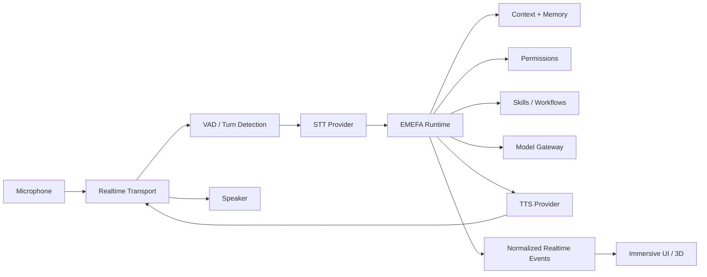

# EMEFA — VOICE_AND_REALTIME.md

> **Document type:** Voice, realtime interaction, provider migration, and immersive assistant specification  
> **Project:** EMEFA  
> **Development mode:** Brownfield continuation  
> **Purpose:** Define a low-latency, interruptible, provider-flexible voice architecture while preserving the high-value realtime and 3D work already implemented by Hermes.  
> **Critical rule:** Do not remove or rewrite the existing ElevenLabs/realtime implementation until its behavior has been audited, benchmarked, reproduced, and a rollback path exists.

---

# 1. Product Objective

Voice is a primary interaction mode for EMEFA.

The target experience is:

> The user speaks naturally, EMEFA understands quickly, can be interrupted, performs real work, communicates progress, and responds with a natural voice while the visual interface reflects what is actually happening.

Voice must not be a decorative demo layer.

It must connect to the same:

- business context;
- memory;
- Skills;
- permissions;
- workflows;
- task state;
- verification

used by text interaction.

---

# 2. Core Principle

EMEFA must own the conversation and task state.

No voice vendor should become the canonical “brain” of EMEFA.

Architecture:

```text
Voice Interface
      ↓
Realtime Session
      ↓
Speech / Turn Processing
      ↓
EMEFA Runtime
      ↓
Context + Memory + Skills + Policy
      ↓
Response / Actions
      ↓
Speech Output
```

Provider-native conversational features may be used where valuable, but EMEFA remains the source of truth for:

- identity;
- context;
- memory;
- permissions;
- tasks;
- tool execution;
- audit.

---

# 3. Brownfield Preservation Rule

Claude must first inspect the current Hermes implementation.

Document:

```text
Current ElevenLabs flow
Current frontend voice state
Current WebSocket/WebRTC behavior
Current interruption behavior
Current transcript handling
Current tool hooks
Current 3D animation hooks
Current authentication
Current provider credentials
Current latency
Current errors
```

Then classify each component:

```text
KEEP
KEEP + HARDEN
REFACTOR
MIGRATE
REPLACE
UNKNOWN / BENCHMARK
```

No speculative rewrite.

---

# 4. Voice Experience Requirements

EMEFA voice should support:

- fast session startup;
- natural turn-taking;
- speech interruption/barge-in;
- partial/final transcription where useful;
- responsive visual states;
- task execution while conversing;
- clear approval interactions;
- graceful reconnect;
- multilingual expansion;
- cost monitoring;
- mobile use.

---

# 5. Target Logical Architecture



This is conceptual.

Adapt to verified repository architecture.

---

# 6. Separation of Responsibilities

## Realtime Transport

Responsible for:

- audio transport;
- session connectivity;
- media streams;
- data/event channels where appropriate.

Candidate:

- LiveKit.

## STT

Responsible for:

- speech-to-text;
- streaming transcription;
- language handling.

## EMEFA Runtime

Responsible for:

- user intent;
- context;
- memory;
- task planning;
- tools;
- permissions;
- verification.

## TTS

Responsible for:

- text-to-speech;
- streaming synthesis;
- voice identity.

## Frontend

Responsible for:

- microphone UX;
- playback;
- transcript display;
- assistant state visualization;
- approvals;
- task progress.

---

# 7. LiveKit Positioning

LiveKit is a candidate infrastructure layer for realtime media and agent sessions.

Potential responsibilities:

```text
WebRTC transport
Room/session lifecycle
Audio streaming
Participant/session state
Data channels
Interruption plumbing
Future multimodal transport
```

LiveKit should not be treated as automatically replacing:

- ElevenLabs voice quality;
- STT;
- TTS;
- LLM;
- EMEFA orchestration;
- memory;
- Skills.

The final architecture may combine LiveKit with multiple providers.

---

# 8. ElevenLabs Positioning

ElevenLabs may continue to provide:

- premium TTS;
- selected voices;
- conversational voice capabilities;
- fallback;
- specific language/accent quality.

Do not remove it solely for architectural purity.

Decision must consider:

```text
Quality
Latency
Cost
Language
Interruption
Reliability
Integration complexity
```

---

# 9. Migration Objective

The objective is not:

> “Replace ElevenLabs.”

The objective is:

> “Reduce provider lock-in and cost while preserving or improving the user experience.”

Possible outcome:

```text
LiveKit
+
Cost-effective STT
+
EMEFA Runtime
+
Cost-effective TTS
+
Optional ElevenLabs Premium Voice
```

---

# 10. Provider Abstractions

Conceptual interfaces:

```text
RealtimeProvider
STTProvider
TTSProvider
```

Possible contracts:

```text
RealtimeProvider:
- create_session
- connect
- disconnect
- publish_audio
- receive_audio/events

STTProvider:
- transcribe_stream
- transcribe_file

TTSProvider:
- synthesize
- synthesize_stream
- cancel
```

Do not force these exact methods if current code suggests better abstractions.

---

# 11. Voice Session Model

Conceptual:

```text
VoiceSession
- id
- tenant_id
- assistant_id
- user_id
- provider
- status
- started_at
- ended_at
- language
- correlation_id
```

Possible states:

```text
CREATING
CONNECTING
CONNECTED
RECONNECTING
ENDING
ENDED
FAILED
```

Voice session state is not task state.

---

# 12. Assistant Interaction State

Normalize assistant states:

```text
IDLE
LISTENING
UNDERSTANDING
PLANNING
AWAITING_APPROVAL
EXECUTING
VERIFYING
SPEAKING
COMPLETED
WARNING
FAILED
```

These states drive UI/3D.

Backend task truth remains authoritative.

---

# 13. Realtime Event Contract

Normalize provider-specific events.

Examples:

```text
session.started
session.connected
session.reconnecting
session.ended
session.error

user.speech_started
user.speech_stopped

transcript.partial
transcript.final

assistant.understanding
assistant.planning
assistant.approval_required
assistant.tool_started
assistant.tool_progress
assistant.tool_completed
assistant.verifying

assistant.speech_started
assistant.speech_stopped
assistant.interrupted

task.completed
task.failed
```

Frontend should depend primarily on normalized EMEFA events.

---

# 14. Interruption / Barge-In

This is mandatory for natural voice.

Scenario:

```text
EMEFA speaking
→ user starts speaking
→ detect user speech
→ stop/cancel current playback quickly
→ preserve conversation state
→ transcribe user
→ process new intent
```

Do not force user to wait for long responses to finish.

---

# 15. Interruption Semantics

An interruption may mean:

- correction;
- new question;
- cancellation;
- clarification;
- approval/rejection.

Example:

EMEFA:

> “J'ai trouvé vingt prospects et je vais maintenant—”

User:

> “Non, seulement ceux au Togo.”

System should:

- stop speech;
- interpret correction;
- update task constraints;
- avoid continuing stale plan.

---

# 16. Cancellation

Voice commands like:

> “Arrête.”

> “Annule ça.”

must map to task cancellation when context clearly indicates it.

Cancellation should propagate to:

- workflow;
- external agent;
- browser task;
- long-running skill;

where technically possible.

---

# 17. Turn Detection

Evaluate:

- VAD;
- endpointing;
- provider turn detection;
- semantic turn detection where available.

Metrics:

- false interruption;
- delayed response;
- clipped user speech;
- premature turn end.

Do not tune only for perfect lab audio.

Test real African/mobile network conditions.

---

# 18. Latency Budget

Measure end-to-end.

Conceptual:

```text
User stops speaking
→ endpoint detected
→ STT final/usable text
→ runtime/model first response
→ TTS first audio
→ playback
```

Track:

- session startup;
- STT latency;
- model TTFT;
- tool latency;
- TTS time-to-first-audio;
- network transport.

Set numeric targets only after baseline.

---

# 19. Perceived Latency

Use legitimate UX techniques:

- streaming;
- concise first acknowledgement when appropriate;
- progress events for long tasks;
- partial transcription;
- prewarming where cost-effective.

Do not fake task completion.

Example:

> “Je vérifie ton agenda.”

is acceptable if the task is actually running.

---

# 20. Long-Running Tasks

Voice should not block while a long task runs.

Example:

User:

> “Trouve-moi 50 prospects et qualifie-les.”

EMEFA:

```text
Create Durable Task
→ acknowledge
→ continue/close voice turn
→ background execution
→ progress
→ notify when complete
```

Do not keep an expensive realtime session open unnecessarily.

---

# 21. Voice + Skills

Voice requests use the same Skills Gateway.

Example:

```text
Speech
→ STT
→ Intent
→ email.send
→ Policy
→ Approval
→ Execute
→ Verify
→ Voice Result
```

Do not create separate voice-only tool logic.

---

# 22. Voice Approval

For consequential actions, voice may request approval.

Example:

> “J'ai préparé l'email pour Ama. Veux-tu que je l'envoie maintenant ?”

Approval should be bound to specific action details.

For higher-risk actions, require visual/stronger confirmation where appropriate.

Do not treat ambiguous speech such as “hmm” as approval.

---

# 23. Voice Confirmation Rules

Clear positive:

```text
Oui, envoie-le.
Confirme.
Vas-y.
```

Potentially ambiguous:

```text
Hmm.
D'accord... attends.
Peut-être.
```

Use confirmation thresholds appropriate to risk.

---

# 24. Transcript Architecture

Transcripts may include:

```text
partial
final
corrected
```

Canonical conversation storage should use stable/finalized content where practical.

Do not create durable memory from unstable partial transcripts.

---

# 25. Transcript Privacy

Define:

- whether transcripts are stored;
- retention;
- user visibility;
- provider retention;
- deletion.

Do not store raw audio/transcripts indefinitely without purpose.

---

# 26. Audio Storage

Default principle:

> Minimize raw audio retention.

Store only if required for:

- user feature;
- debugging with consent/policy;
- quality evaluation;
- compliance.

Prefer short retention or no storage where possible.

---

# 27. Voice Identity

EMEFA should have a distinctive voice identity.

Requirements:

- professional;
- warm;
- natural;
- intelligible;
- appropriate for target users.

Avoid copying a protected celebrity/fictional voice.

Aim for an original EMEFA identity.

---

# 28. Voice Profiles

Future:

```text
EMEFA Default
Professional Female
Professional Male
Regional Voices
Local Language Voices
Premium Voices
```

Voice profile should be configuration, not hard-coded.

---

# 29. African Voice Strategy

Differentiation opportunity:

- African-accented French;
- local languages;
- natural code-switching;
- regional pronunciation.

Must be evaluated empirically.

Do not market unsupported language quality.

---

# 30. Language Pipeline

Conceptual:

```text
Audio
→ Language Detection / Session Preference
→ STT
→ Normalized Text
→ EMEFA Runtime
→ Response Language Decision
→ TTS
```

User preference can influence but not override actual capability.

---

# 31. French

French should be a first-class launch language for target markets.

Test:

- West African accents;
- business vocabulary;
- names;
- code-switching;
- noisy environments.

---

# 32. Local Languages

Candidate evaluation may include:

- Ewe;
- Kabiye;
- Mina/Gen-related varieties;
- other languages based on target-market research.

For each language benchmark:

```text
STT accuracy
Names/entities
Code-switching
TTS naturalness
Latency
Cost
Provider availability
```

---

# 33. Local Language Success

Success is not:

> “The model can say a few phrases.”

Success means:

```text
User speaks naturally
→ intent understood
→ real task completed correctly
→ response understandable
```

---

# 34. Code-Switching

Example:

> French sentence + Ewe phrase + company name + English technical term.

Pipeline should preserve intent and entities.

Do not translate names or business terms incorrectly.

---

# 35. Provider Benchmark Matrix

Before voice migration, create a benchmark.

Columns:

```text
Provider/Stack
STT Quality
TTS Quality
Latency
Barge-In
French
African Accents
Local Languages
Mobile
Reliability
Cost/Minute
Integration Complexity
Privacy/Retention
```

Use actual measured values.

---

# 36. Baseline Existing ElevenLabs

Measure current implementation first.

Required:

- session startup;
- average response latency;
- interruption quality;
- transcript accuracy;
- voice quality;
- mobile behavior;
- cost estimate;
- failure rate.

This is the benchmark to beat or justify tradeoffs against.

---

# 37. Candidate Stack Evaluation

Potential architecture to test:

```text
LiveKit
+ STT Provider A/B
+ EMEFA Runtime
+ TTS Provider A/B
```

Also test:

```text
LiveKit
+ cost-effective STT
+ EMEFA
+ ElevenLabs TTS
```

Hybrid may be optimal.

---

# 38. Cost Model

Track per session:

```text
Realtime transport minutes
STT minutes
LLM tokens
TTS characters/minutes
Tool calls
Background tasks
```

Estimate:

```text
cost_per_voice_minute
cost_per_active_user
cost_per_completed_task
```

Optimize cost per valuable outcome, not only voice minute.

---

# 39. Cost Controls

Potential:

- session idle timeout;
- automatic close when background task begins;
- cheaper model routing;
- TTS caching for static phrases where useful;
- provider tiers;
- quotas;
- concise responses.

Do not degrade UX blindly to save tiny amounts.

---

# 40. Reconnect

Mobile networks fail.

Support:

```text
CONNECTED
→ temporary loss
→ RECONNECTING
→ restore session/context
```

Task state must survive media disconnect where appropriate.

Do not lose an executing task because WebRTC dropped.

---

# 41. Session Resume

If voice reconnects:

- restore conversation/task context;
- do not replay stale speech automatically;
- explain important state changes.

Example:

> “La connexion a été interrompue. La recherche a continué et j'ai trouvé 12 prospects.”

Only say this if true.

---

# 42. Offline / Poor Network

Graceful degradation may include:

- text fallback;
- reduced visual effects;
- lower bitrate;
- retry;
- queued non-realtime work.

Full offline AI is not required initially.

---

# 43. Mobile Browser

Test:

- microphone permissions;
- autoplay restrictions;
- background behavior;
- Bluetooth devices;
- headset switching;
- screen lock;
- network switching.

Do not assume desktop Chrome behavior.

---

# 44. Audio Device Management

Support:

- permission denied;
- no microphone;
- device changed;
- Bluetooth disconnect;
- output unavailable.

Provide clear UX.

---

# 45. Echo and Noise

Evaluate:

- echo cancellation;
- noise suppression;
- automatic gain;
- headset behavior.

Use browser/LiveKit capabilities where appropriate.

Do not overprocess voice if it harms recognition.

---

# 46. Immersive 3D Integration

Existing Hermes 3D work should be preserved where valuable.

3D should react to normalized state:

```text
IDLE → ambient
LISTENING → receptive
UNDERSTANDING → processing
PLANNING → deeper processing
EXECUTING → active
SPEAKING → synchronized response state
WARNING → attention
FAILED → error state
```

Do not hard-code ElevenLabs events directly throughout 3D components.

---

# 47. JARVIS-Class Experience

Target qualities:

- spatial presence;
- immediacy;
- elegant motion;
- contextual state;
- responsive visualization;
- voice-first interaction.

Do not copy:

- JARVIS name as product identity;
- actor voice;
- protected visual assets;
- copyrighted dialogue.

EMEFA needs an original identity.

---

# 48. Audio-Reactive Visuals

Visuals may react to:

- input amplitude;
- output amplitude;
- speaking state;
- tool activity.

Avoid expensive rendering that degrades voice latency.

Use decoupled animation loops.

---

# 49. Lip Sync / Avatar

Not required for initial EMEFA unless existing implementation already depends on it.

A sophisticated abstract 3D presence may be more distinctive and performant.

If avatar added later:

- phoneme/viseme support;
- latency;
- uncanny-valley testing.

---

# 50. Reduced Motion

Respect accessibility.

Provide reduced-motion mode.

Voice functionality must remain fully usable without 3D.

---

# 51. No-WebGL Fallback

If 3D cannot render:

- conversation;
- voice;
- tasks;
- approvals

must still work.

3D is presentation, not core execution.

---

# 52. Frontend State Separation

Recommended:

```text
Media State
Assistant State
Task State
UI State
```

Do not collapse everything into one boolean like:

```text
isSpeaking
```

Example:

EMEFA can be:

```text
media connected
task executing
not speaking
UI showing progress
```

---

# 53. Voice and Task Progress

For tools:

```text
assistant.tool_started
assistant.tool_progress
assistant.tool_completed
```

UI can show:

> Recherche de prospects — 12/20 analysés

Voice should summarize progress selectively.

Do not narrate every internal tool call.

---

# 54. Internal Reasoning Privacy

Never expose chain-of-thought.

Expose useful status:

```text
“Je compare les entreprises à ton profil client.”
```

Not private reasoning traces.

---

# 55. Error Experience

Examples:

STT failure:

> “Je n'ai pas bien compris la dernière phrase. Peux-tu la répéter ?”

Tool failure:

> “J'ai compris la demande, mais l'accès au calendrier a échoué.”

TTS failure:

- show text immediately;
- retry/fallback if available.

Never pretend success.

---

# 56. Provider Failure

Fallback matrix may include:

```text
STT A fails → STT B if safe/configured
TTS A fails → TTS B or text
Realtime transport fails → text fallback
```

Do not switch providers if privacy/data policy forbids it.

---

# 57. Feature Flags

Voice migration requires flags such as:

```text
voice_stack=legacy_elevenlabs
voice_stack=livekit_hybrid
```

Potential tenant/user percentage rollout.

Maintain rollback.

---

# 58. Parallel Validation

Before cutover:

```text
Existing Stack
vs
New Stack
```

Compare identical scripted scenarios.

For STT, optionally shadow transcription with privacy controls.

Do not duplicate sensitive audio to providers without policy/consent.

---

# 59. Voice Evaluation Dataset

Create test scenarios:

- French business speech;
- West African accents;
- names/companies;
- numbers;
- dates;
- email addresses;
- interruptions;
- noisy environment;
- code-switching;
- long commands;
- tool approvals.

Use reproducible evaluation.

---

# 60. Example Test — Interruption

EMEFA begins a 20-second response.

At second 3 user says:

> “Attends, change plutôt la date.”

Pass criteria:

- playback stops promptly;
- new speech captured;
- stale action not executed;
- context updated.

---

# 61. Example Test — Approval

EMEFA:

> “Veux-tu que j'envoie l'email à 25 prospects ?”

User:

> “Hmm… non, attends.”

Expected:

- no send.

---

# 62. Example Test — Network Loss

During prospect research, voice disconnects.

Expected:

- durable task continues if appropriate;
- reconnect shows true state;
- no duplicate execution.

---

# 63. Example Test — Local Language

User gives a supported local-language command.

Expected:

- correct transcription/intent;
- correct task;
- appropriate response.

Measure task success, not only word error rate.

---

# 64. Security

Voice session tokens must be:

- server-issued;
- short-lived;
- scoped.

Do not expose long-lived provider secrets.

Authenticate realtime channels.

Validate webhooks.

Apply tenant isolation.

---

# 65. Voice Prompt Injection

Speech itself is user input.

But voice can also read malicious content aloud.

Example:

User asks EMEFA to read an email containing malicious instructions.

The content remains untrusted.

TTS output must not transform external text into system authority.

---

# 66. Voice Biometrics

Do not assume speaker identity merely from voice unless an explicitly designed biometric authentication system exists.

A person speaking through an authenticated session is not automatically authorized for high-risk actions beyond session policy.

For sensitive actions, use stronger confirmation/authentication where needed.

---

# 67. Observability

Track:

```text
voice_session_started
voice_session_connected
voice_session_failed
speech_started
stt_final
assistant_first_token
tts_first_audio
barge_in
reconnect
voice_session_ended
```

Metrics:

- p50/p95 latency;
- error rate;
- reconnect rate;
- interruption success;
- cost/minute;
- session duration.

---

# 68. Privacy-Safe Debugging

For debugging:

Prefer:

- event timings;
- provider error codes;
- redacted transcripts.

Avoid routine storage of raw audio.

If sampled audio is used for quality evaluation, use explicit governance.

---

# 69. Deployment

Realtime infrastructure may be:

- managed;
- self-hosted;
- hybrid.

Decision criteria:

```text
Cost
Operations
Latency
Region
Scaling
Privacy
Reliability
Team capacity
```

Do not self-host merely because software is open source.

Operational cost matters.

---

# 70. LiveKit Deployment Decision

Evaluate:

```text
LiveKit Cloud
vs
Self-hosted LiveKit
```

For early stage, managed infrastructure may reduce operational burden even if not “free.”

Self-hosting still costs:

- servers;
- bandwidth;
- TURN;
- monitoring;
- maintenance;
- engineering time.

Record decision in ADR.

---

# 71. TURN Infrastructure

WebRTC often needs TURN.

Include TURN bandwidth/cost in analysis.

Test restrictive corporate/mobile networks.

Do not benchmark only direct peer connectivity.

---

# 72. Scalability

Design sessions stateless where possible, with durable state outside realtime process.

Separate:

```text
Ephemeral Media Session
from
Durable EMEFA Task
```

This enables scaling/reconnect.

---

# 73. Concurrency

Plan for:

- many voice sessions;
- background tasks;
- TTS streaming;
- provider rate limits.

Use backpressure.

Do not allow one tenant to exhaust shared resources.

---

# 74. Voice Queueing

If provider capacity unavailable:

- fail gracefully;
- queue only when appropriate;
- offer text fallback.

Realtime conversation should not silently wait minutes.

---

# 75. Response Style for Voice

Voice responses should usually be shorter than long text responses.

Pattern:

```text
Answer / status
→ key detail
→ next action
```

Detailed reports can appear visually as artifacts.

Do not read entire long documents aloud unless requested.

---

# 76. Voice + Visual Complementarity

Example:

EMEFA says:

> “J'ai trouvé 20 prospects. Les 6 meilleurs sont affichés à droite.”

Visual UI shows:

- prospect cards;
- scores;
- evidence;
- actions.

Voice and screen should complement each other.

---

# 77. Approval UI Complementarity

Voice:

> “J'ai préparé trois emails. Ils sont prêts pour validation.”

UI:

```text
Preview
Edit
Approve
Reject
```

This is safer than reading every email aloud.

---

# 78. Voice Persona

EMEFA's voice personality should be:

- competent;
- concise;
- warm;
- calm;
- culturally appropriate.

Avoid excessive filler.

Adapt formality based on user preference.

---

# 79. Emotion / Prosody

Use expressive TTS carefully.

EMEFA should not simulate manipulative emotional dependency.

Prosody should improve clarity and naturalness.

---

# 80. Voice Customization

Future settings:

```text
Voice
Speed
Verbosity
Language
Interruption sensitivity
Automatic listening behavior
```

Defaults should be safe and simple.

---

# 81. Wake Word

Not required for web MVP.

If later added:

- privacy implications;
- always-listening concerns;
- local processing preference;
- false activation.

Do not implement casually.

---

# 82. Continuous Listening

Default should not imply indefinite background recording.

Use clear microphone state.

Users must understand when EMEFA is listening.

---

# 83. Push-to-Talk

May be useful as fallback:

- noisy environments;
- privacy;
- poor VAD;
- mobile.

Support without undermining natural realtime mode.

---

# 84. Voice Session Lifecycle UX

Conceptual:

```text
Start
→ Permission
→ Connecting
→ Ready
→ Listening / Speaking
→ Background Task if needed
→ End
```

Clearly show connection state.

---

# 85. First Voice MVP

Minimum compelling capability:

- start voice session;
- French conversation;
- low-latency streaming;
- interruption;
- shared context with text;
- one real Skill;
- approval flow;
- graceful errors;
- immersive state synchronization.

Do not wait for every local language.

---

# 86. Recommended Voice Migration Sequence

## Phase 0 — Audit

Document current ElevenLabs implementation.

## Phase 1 — Stabilize

Fix security/credential/state issues without changing UX.

## Phase 2 — Normalize Events

Create EMEFA-owned event/state contracts.

## Phase 3 — Provider Boundaries

Introduce Realtime/STT/TTS interfaces around current behavior.

## Phase 4 — Prototype

Build LiveKit hybrid behind feature flag.

## Phase 5 — Benchmark

Compare cost, latency, quality, interruption, mobile.

## Phase 6 — Pilot

Small controlled rollout.

## Phase 7 — Migrate

Only if evidence supports it.

## Phase 8 — Optimize

Add provider routing/local-language experiments.

---

# 87. Migration Acceptance Criteria

Do not switch default stack unless:

- no critical regression;
- interruption works;
- French quality acceptable;
- mobile acceptable;
- latency acceptable;
- tool execution remains correct;
- 3D state remains synchronized;
- security reviewed;
- cost advantage understood;
- rollback tested.

---

# 88. Rollback

At all migration stages:

```text
New Voice Stack fails
→ switch feature flag
→ restore legacy stack
```

Do not delete legacy implementation immediately after first success.

Remove only after stable production evidence.

---

# 89. ADR Required

Create:

```text
ADR-001 — Voice and Realtime Architecture
```

Include:

- current state;
- alternatives;
- benchmark;
- costs;
- selected architecture;
- migration;
- rollback;
- unresolved risks.

---

# 90. Definition of Done — Voice Stack

A production voice stack requires:

- authentication;
- tenant isolation;
- secure tokens;
- realtime transport;
- STT;
- EMEFA runtime integration;
- TTS;
- interruption;
- cancellation;
- reconnect;
- normalized events;
- UI synchronization;
- error handling;
- metrics;
- cost tracking;
- privacy policy;
- tests;
- mobile validation.

---

# 91. Anti-Patterns

Do not build:

```text
Voice provider = EMEFA brain
```

Do not:

- expose provider API secrets in client;
- rewrite working voice without benchmark;
- create separate memory for voice;
- create voice-only business logic;
- fake low latency by claiming completion early;
- keep expensive realtime sessions open for long background jobs;
- assume LiveKit is free merely because it is open source;
- assume ElevenLabs must be removed;
- claim local-language support without evaluation.

---

# 92. North-Star Interaction

User speaks:

> “EMEFA, trouve-moi 20 nouveaux prospects au Togo cette semaine et prépare les meilleurs pour que je les contacte.”

EMEFA:

1. understands speech;
2. loads business profile and ICP;
3. clarifies only if necessary;
4. creates durable task;
5. searches/researches through Skills;
6. qualifies prospects;
7. prepares outreach;
8. asks approval before communication if required;
9. reports results through voice;
10. displays detailed evidence visually.

During the process, the user can say:

> “Attends, seulement les entreprises de plus de 20 employés.”

EMEFA interrupts immediately, updates constraints, and continues correctly.

That is the target.

---

# 93. Final Principle

> **Voice is the interface to EMEFA, not the architecture of EMEFA.**

The best stack is not necessarily the cheapest provider or the most impressive demo.

The correct architecture is the one that gives EMEFA:

```text
Natural Interaction
+ Low Latency
+ Interruption
+ Real Task Execution
+ Provider Flexibility
+ African Language Potential
+ Cost Control
+ Reliability
```

while preserving the most important invariant:

> **Whether the user speaks or types, they are interacting with the same EMEFA — the same memory, the same skills, the same permissions, and the same understanding of their business.**


---

# 94. Voice Catalog and User Choice — Mandatory Product Requirement

EMEFA must not impose one default “African voice” on every user.

The product must provide a **voice catalog** similar in usability to modern conversational assistants:

```text
Settings
→ Voice & Languages
→ Choose Language
→ Browse Compatible Voices
→ Listen to Preview
→ Select Preferred Voice
→ Save
```

The user should be able to listen before choosing.

Voice selection must be independent from the underlying provider.

Example user-facing configuration:

```text
Language: Français
Voice: Ama
Style: Chaleureuse et professionnelle
```

The user should not need to know whether the voice is powered by:

- ElevenLabs;
- another cloud TTS provider;
- an open-source model;
- a self-hosted model;
- a future EMEFA proprietary voice stack.

Provider implementation is an internal concern.

---

# 95. French-African Voice Priority

For the initial target market, EMEFA should prioritize **authentic francophone African voices**.

The target is not:

```text
English-accented French
Canadian French used as a substitute for African French
Artificial French/English mixing
Generic “international” voices mislabeled as African
```

The target is natural professional French as spoken by francophone African users, especially relevant to West African markets.

Candidate voice profiles may include:

```text
French — West African Female
French — West African Male
French — Neutral African Francophone
French — Standard International
```

Actual public names should be product-friendly and culturally appropriate rather than generic technical labels.

Do not claim a specific regional accent unless validated with native speakers from that region.

---

# 96. Language, Voice, Accent, and Provider Are Separate Concepts

The architecture must model separately:

```text
Language
Voice
Accent / Locale Profile
Provider
Voice Model
```

Example:

```yaml
language: fr
locale_profile: fr-west-africa
voice_id: emefa_ama
provider: provider_x
provider_voice_id: internal_reference
```

This separation allows EMEFA to replace a provider without changing the user's selected voice identity where a suitable replacement exists.

---

# 97. Voice Catalog Model

Conceptual metadata:

```yaml
id: string
display_name: string
language: string
locale_profile: string
gender/presentation: optional
style_tags:
  - professional
  - warm
  - calm

provider: internal
provider_voice_reference: secret_or_internal

preview_asset: reference

quality_status:
  - experimental
  - verified
  - premium

supported_features:
  streaming: true
  expressive: true
  multilingual: false

availability:
  regions: []
  plans: []

version: string
```

Do not expose sensitive provider identifiers unnecessarily.

---

# 98. Voice Preview Experience

Users must be able to preview voices before selection.

Recommended UX:

```text
Voice Card
├── Name
├── Language
├── Accent / Locale description
├── Short style description
├── Play Preview
└── Select
```

Preview samples should use standardized sentences so voices can be compared fairly.

Include realistic business-oriented French.

Example evaluation content:

> “Bonjour, voici votre programme de la journée. Vous avez une réunion à neuf heures avec votre équipe commerciale.”

Also test:

- African names;
- company names;
- city names;
- dates;
- numbers;
- FCFA amounts.

---

# 99. Voice Quality Validation

A voice must not enter the “Verified” catalog solely because a provider labels it as French.

Evaluate:

```text
Naturalness
French pronunciation
Accent authenticity
African names
Business vocabulary
Numbers and currency
Long-form consistency
Emotional neutrality
Code-switching behavior
Streaming latency
```

Use human evaluation with native/target-market speakers.

---

# 100. Prevent Unwanted English Influence

A recurring quality issue to detect is French speech with inappropriate English phonology or accidental language switching.

Benchmark sentences should test:

```text
French-only sentences
Proper nouns
Technical terms
English brand names inside French sentences
Abbreviations
URLs
Email addresses
```

The system must distinguish legitimate code-switching from accidental provider behavior.

Example:

User requests French-only response.

Expected:

- French syntax;
- natural French pronunciation;
- no unnecessary English words;
- foreign brand names pronounced intelligibly without changing the entire accent.

---

# 101. Language Configuration

Users should be able to configure:

```text
Primary interaction language
Preferred voice
Optional secondary languages
Automatic language detection preference
Code-switching preference where supported
```

Example:

```text
Primary: Français
Voice: Ama
Secondary: Ewe
Auto-detect: Enabled
```

Only expose options supported reliably by the active stack.

---

# 102. Voice Filtering by Language

When user chooses:

```text
Français
```

show primarily voices validated for French.

Allow optional filters such as:

```text
African Francophone
International French
Female
Male
Warm
Professional
Calm
```

Avoid overwhelming users with hundreds of low-quality provider voices.

Curate the catalog.

---

# 103. African-First Curation

EMEFA's differentiation should include strong representation of high-quality African voices.

The default catalog ordering for target African markets may prioritize:

1. Verified African Francophone voices
2. Other verified French voices
3. Experimental/local-language voices
4. Additional international voices

This is a product-curation choice, not a restriction.

Users remain free to choose the voice they prefer.

---

# 104. Local Language Catalog

Local languages should use the same catalog architecture.

Potential future entries:

```text
Ewe
Mina / Gen varieties where technically supported
Kabiye
Other regional languages
```

A language becomes publicly selectable only after minimum quality thresholds are met.

Do not list a language merely because a model technically accepts its language code.

---

# 105. Local-Language Verification

For each candidate language:

```text
Native-speaker evaluation
STT comprehension
TTS intelligibility
Natural pronunciation
Names/entities
Numbers
Business terminology
Code-switching
Task success
```

The final criterion is:

> Can a user naturally ask EMEFA to perform real work in this language and reliably understand the response?

---

# 106. Provider Routing Behind the Catalog

User chooses a **voice identity**, not a vendor.

Conceptual:

```text
User Voice Selection
        ↓
EMEFA Voice Catalog
        ↓
Voice Routing Layer
        ├── Provider A
        ├── Provider B
        ├── Self-hosted TTS
        └── Premium Provider
```

Routing may consider:

```text
selected voice
language
quality
latency
cost
availability
tenant plan
region
```

Never silently change to a substantially different voice personality without appropriate fallback UX.

---

# 107. Voice Fallback

If selected voice is unavailable:

Preferred behavior:

```text
Retry briefly
→ compatible fallback if user has enabled fallback
→ otherwise text response / notify user
```

Possible setting:

```text
Voice fallback:
[✓] Use closest compatible voice when my selected voice is temporarily unavailable
```

Do not unexpectedly switch language.

---

# 108. Voice Cost Tiers

The catalog may support internal tiers:

```text
Standard
Premium
Experimental
```

A premium provider such as ElevenLabs may remain available for voices where quality justifies cost.

Lower-cost/self-hosted providers may power other verified voices.

This enables cost optimization without removing user choice.

---

# 109. Voice Provider Benchmarking for African French

Provider evaluation must include a dedicated African Francophone benchmark.

Do not rely only on generic vendor demos.

Test with phrases such as:

```text
Lomé
Cotonou
Ouagadougou
Abidjan
Dakar
Koffi
Ama
Kodjo
CFA / FCFA amounts
OHADA terminology where relevant
regional company names
```

Use native evaluators.

Record results in the voice-provider ADR/benchmark.

---

# 110. Custom Voice Future

Future enterprise capability may allow organizations to select or commission a custom branded voice.

Requirements:

- explicit rights/consent;
- anti-impersonation controls;
- secure voice assets;
- provider/legal compliance.

Do not clone real individuals without proper authorization.

---

# 111. Voice Settings Persistence

Store user preference canonically in EMEFA:

```text
preferred_language
preferred_voice_id
secondary_languages
auto_language_detection
code_switching_preference
fallback_preference
```

Do not store only provider-specific IDs.

This preserves settings during provider migration.

---

# 112. Voice Migration Compatibility

When migrating away from a provider:

```text
Existing User Voice
→ Find equivalent/replacement mapping
→ Quality test
→ Preserve preference if possible
→ Notify user if voice materially changes
```

Do not reset every user's voice preference because backend provider changed.

---

# 113. Updated Voice Product Principle

EMEFA should not ask:

> “Which provider voice do you want?”

It should ask:

> “Quelle voix préférez-vous pour EMEFA ?”

The user hears samples and chooses naturally.

Internally, EMEFA handles provider complexity.

For the initial African market, the catalog must make **authentic, high-quality francophone African voices a first-class experience**, while still giving every user freedom to choose the language and voice they personally prefer.
