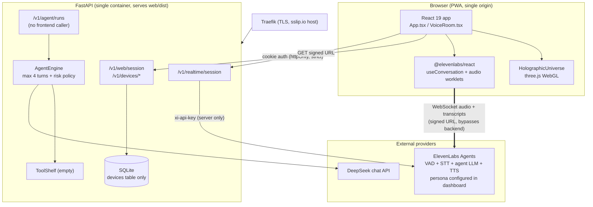

# EMEFA — Current Architecture (Phase 0, verified)

> **Date:** 2026-07-20 · Derived exclusively from code inspection at commit `6fa6f62`.
> Companion documents: `REPOSITORY_AUDIT.md` (findings), `GAP_ANALYSIS.md` (target deltas).

## 1. System Diagram (as implemented)



Trust boundaries: browser is untrusted (auth via enrollment code → hashed token); ElevenLabs and DeepSeek are external trust zones; the only secret-bearing zone is the backend container (`.env`, chmod 600 on the VPS).

## 2. Key Flows

### 2.1 Activation
`Activation` form → `POST /v1/web/session {name, enrollment_code}` → `compare_digest` against `EMEFA_ENROLLMENT_CODE` → device cap check (3) → `DeviceRepository.enroll()` (urlsafe token, SHA-256 hash stored) → token set as `emefa_session` cookie (httpOnly, secure, SameSite=strict, 30 d). Subsequent requests authenticate via `current_device` (cookie or Bearer).

### 2.2 Voice conversation (the real product path)
`VoiceOrb` click → `getUserMedia` (permission only, tracks stopped) → `GET /v1/realtime/session` (device-authenticated) → backend `RealtimeGateway.get_signed_url()` calls ElevenLabs `get-signed-url` with server-held API key → browser opens the provider WebSocket directly. **All intelligence (VAD, STT, reasoning, persona, TTS, barge-in) is executed inside ElevenLabs' Agents platform.** Transcripts stream back via `onMessage`; UI state (`idle/listening/thinking/speaking/error`) derives from SDK callbacks and drives the hologram's color/motion.

### 2.3 Text agent (implemented, orphaned)
`POST /v1/agent/runs {message}` → `AgentEngine.run()`: history (in-process dict per device, last 12 turns) → `Brain.think()` (DeepSeek, tools discarded) → answer, or tool-step path: registry lookup → `decide(risk)` → RUN (execute handler) / ASK (`confirmation_required` + pending action) / BLOCK. Turn budget 4. **No UI calls this endpoint; there is no confirmation UI.**

### 2.4 Static serving
`web/dist` mounted at `/` by FastAPI when `EMEFA_WEB_DIST_PATH` is set (Docker sets it); Vite dev proxy targets `127.0.0.1:8765` for local dev.

## 3. Architectural Reality vs. the Two-Brain Problem

```text
Voice user ──► ElevenLabs agent brain (dashboard persona, provider LLM)   ← what users actually get
Text API  ──► DeepSeek brain + policy + (empty) tools                     ← where the governed architecture lives
```

These paths share **no context, no memory, no policy**. Every platform capability the specs require (memory, skills, approvals, audit) can only be enforced in the backend path — which the product does not currently use. This is the central architectural fact that Phase 1+ must resolve (see `GAP_ANALYSIS.md` §Voice).

## 4. State & Persistence

| Store | Content | Durability |
|---|---|---|
| SQLite `devices` | device_id, name, token_hash, created_at | Durable (Docker volume) |
| `AgentEngine._conversations` | per-device rolling 12-turn history | Process memory — lost on restart |
| ElevenLabs session | voice conversation state | Provider-side, per-connection |
| Browser | session cookie; PWA cache (`sw.js`: shell assets) | Client |

No migrations mechanism (single `CREATE TABLE IF NOT EXISTS`), no vector store, no object storage, no queues, no background workers, no scheduler.

## 5. Configuration Surface (complete)

`EMEFA_ENROLLMENT_CODE`, `EMEFA_DATABASE_PATH`, `EMEFA_MAX_DEVICES`, `EMEFA_COOKIE_SECURE`, `EMEFA_SESSION_MAX_AGE_SECONDS`, `EMEFA_DEEPSEEK_API_KEY`, `EMEFA_DEEPSEEK_MODEL`, `EMEFA_OPENAI_API_KEY`*, `EMEFA_REALTIME_MODEL`*, `EMEFA_REALTIME_VOICE`*, `EMEFA_ELEVENLABS_API_KEY`, `EMEFA_ELEVENLABS_AGENT_ID`, `EMEFA_WEB_DIST_PATH`.
*Unused remnants of an earlier OpenAI-realtime direction — no code reads them beyond `Settings`.

## 6. Non-Existent Layers (explicit, to prevent assumption)

Users/tenants/organizations · assistants as entities · onboarding · memory system · skills/tools in use · MCP · external agents · document generation · email/calendar · prospecting · workflows/scheduling · approval inbox · audit log · observability · rate limiting · CI/CD (no `.github/workflows`) · i18n framework (UI is hard-coded French).
